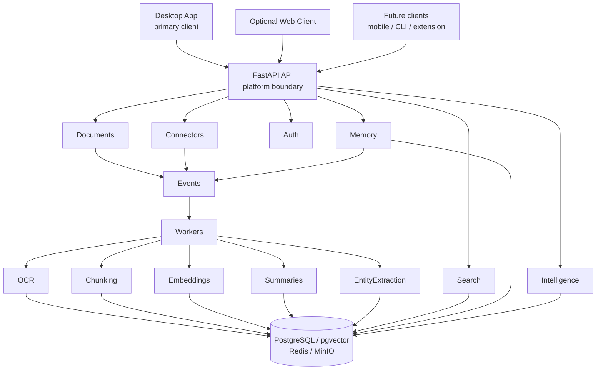

# Memovi Architecture

> This document is the high-level architectural blueprint for Memovi. It defines the platform shape, canonical boundaries, and documentation map. Detailed engineering references live under `architecture/`.

For the canonical product vision—what Memovi is and why the architecture
exists—see [`PRODUCT_VISION.md`](PRODUCT_VISION.md).

---

# Purpose

Memovi is a desktop-first, AI-native knowledge operating system built on a
reusable backend platform. It is not primarily a web application, and it is not
a collection of isolated AI features.

The flagship client is a desktop application. The same client-agnostic API also
supports an optional web client and can support future mobile or CLI clients
without changing backend domain architecture.

The purpose of this document is to provide a complete architectural overview of the platform without carrying every implementation detail. It explains the goals, principles, system layers, domain boundaries, repository organization, knowledge lifecycle, and technology choices that guide the project.

The focused documents under `architecture/` expand this blueprint. When deeper detail is needed, follow the links in the Documentation Map rather than duplicating material here.

This document is intended for:

* Engineers contributing to Memovi
* Future maintainers
* AI coding assistants such as Cursor
* Reviewers interested in the system's design

Whenever implementation and architecture diverge, update one or both so the system and its documentation remain aligned.

---

# Architectural Goals

Memovi's architecture is organized around a small number of long-term goals.

## Build a Platform

Memovi is not a single UI.

It is a reusable backend platform whose flagship product is a desktop knowledge
operating system. The API is the platform boundary. Additional clients—optional
web, future mobile, CLI, browser extensions, public APIs, and third-party
integrations—consume the same capabilities.

Every client should interact with the same core platform. Business logic should
never be duplicated simply because a new client is introduced. Clients are
replaceable; backend domains remain independent.

Desktop is the preferred experience because it enables local models, filesystem
access, automation, and a richer UX without changing backend architecture.

## Knowledge Is the Product

The platform exists to organize, preserve, retrieve, and enrich knowledge.

Artificial intelligence is one consumer of that knowledge. It is not the system itself.

This distinction allows Memovi to remain valuable regardless of which language model, embedding model, or AI provider is used. Knowledge should remain portable, structured, and independently useful.

## Design for Evolution

Requirements will change. New connectors will be built. Search techniques will improve. AI providers will evolve.

The architecture is optimized for change. Systems should be extended rather than replaced whenever possible.

## Maintain Strong Boundaries

Every domain owns a clearly defined responsibility.

Modules communicate through stable interfaces and domain events rather than implementation details. Strong boundaries reduce coupling today and enable future service extraction if operational requirements justify it.

## Favor Operational Simplicity

Operational complexity is introduced only when it provides measurable value.

Memovi begins as a modular monolith because it minimizes deployment complexity while preserving architectural boundaries. Additional infrastructure should be introduced only after operational requirements demonstrate a clear need.

---

# Architectural Principles

## Modular Monolith

Memovi begins as a modular monolith. Each business domain exists as an independent module within a single deployable application.

Every module owns its public APIs, application services, domain models, persistence, domain events, and tests. Modules communicate through well-defined interfaces and events rather than direct implementation details.

The goal is not to avoid microservices. The goal is to delay distributed complexity until it becomes operationally beneficial.

See [`architecture/module-architecture.md`](architecture/module-architecture.md).

## Domain-Driven Design

The system is organized around business domains rather than technical layers.

Core domains include:

* Authentication
* Documents
* Memory
* Search
* Connectors
* Intelligence

Each domain contains everything required to fulfill its responsibility. Business rules remain independent of frameworks, databases, and infrastructure.

See [`architecture/domains.md`](architecture/domains.md).

## Layered Architecture

Every component belongs to one architectural layer. Responsibilities do not cross layers without explicit justification.

The primary layers are:

1. Presentation
2. Application
3. Knowledge Platform
4. Intelligence
5. Processing
6. Infrastructure

Dependencies point downward. Lower layers never depend on higher layers.

See [`architecture/module-architecture.md`](architecture/module-architecture.md).

## Event-Driven Processing

Long-running operations communicate through domain events whenever doing so reduces coupling.

Examples include:

* Document uploaded
* Embeddings generated
* Connector synchronized
* Memory indexed

Events describe what happened. They do not command other components what to do.

See [`architecture/event-architecture.md`](architecture/event-architecture.md).

## Asynchronous Workflows

Expensive operations should not block the user experience.

Tasks such as OCR, document parsing, chunk generation, embedding creation, AI summarization, and search indexing execute through background processing.

See [`architecture/request-lifecycle.md`](architecture/request-lifecycle.md) and [`architecture/knowledge-processing-pipeline.md`](architecture/knowledge-processing-pipeline.md).

## API-First Design

Every capability exposed by the platform should be accessible through stable
application interfaces. The API is the platform boundary between reusable
backend domains and replaceable clients.

Desktop, optional web, and future clients consume the same platform capabilities
rather than implementing business logic independently.

See [`architecture/request-lifecycle.md`](architecture/request-lifecycle.md).

## Self-Hostable by Default

Memovi is designed to be deployable on personal hardware, home servers, or cloud infrastructure.

No architectural decision should unnecessarily require proprietary cloud services. Cloud-native technologies are encouraged; cloud-required architecture is avoided whenever practical.

See [`architecture/deployment.md`](architecture/deployment.md).

## Observability by Design

Operational visibility is a core architectural concern.

The platform should provide visibility into requests, background jobs, AI inference, connector synchronization, search operations, errors, and performance.

See [`architecture/observability.md`](architecture/observability.md).

---

# High-Level System Architecture

Memovi is organized as a layered knowledge platform.

Information enters the platform through connectors, is processed into structured knowledge, stored in a unified memory system, and later retrieved by users or intelligent services.

This separation allows knowledge to remain independent from the technologies used to analyze or consume it. As artificial intelligence evolves, the platform should adopt new models, reasoning systems, and retrieval techniques without changing how knowledge is stored or managed.

---

# Canonical Mermaid Diagram



Additional clients attach at the API without changing Documents, Memory, Search,
or Intelligence. This diagram emphasizes responsibility boundaries over
implementation details. Lower-level interactions are described in the deep-dive
documents.

---

# System Layers

```text
Presentation
        │
        ▼
Application
        │
        ▼
Knowledge Platform
        │
        ▼
Intelligence
        │
        ▼
Processing
        │
        ▼
Infrastructure
```

## Presentation Layer

The Presentation Layer contains every interface through which users interact with Memovi.

The primary product surface is the desktop application. An optional web client,
future mobile clients, browser extensions, CLI tools, and public APIs are
additional presentation surfaces over the same backend.

Responsibilities:

* Render user interfaces
* Accept user input
* Display results
* Authenticate users
* Call platform APIs

The Presentation Layer contains no business logic. Business rules belong within
the Application Layer and domains. Clients remain replaceable; backend domains
do not depend on any specific UI technology.

## Application Layer

The Application Layer coordinates work across domains.

Responsibilities include request validation, authorization, commands, queries, application services, transaction boundaries, DTOs, and API orchestration.

The Application Layer does not perform OCR, generate embeddings, communicate with AI providers, or query vector indexes directly. It coordinates the appropriate platform services.

## Knowledge Platform Layer

The Knowledge Platform Layer is the heart of Memovi.

Primary concerns include Documents, Memory, Search, Connectors, Collections, Tags, Metadata, and the future Knowledge Graph.

This layer organizes knowledge, stores metadata, manages relationships, retrieves information, and maintains consistency. It must remain valuable even when no AI services are available.

## Intelligence Layer

The Intelligence Layer consumes knowledge. It never owns it.

Responsibilities include chat, retrieval-augmented generation, prompt construction, tool orchestration, provider routing, AI summaries, planning, reasoning, and future autonomous agents.

The `packages/intelligence` package currently defines the reasoning domain foundation (`ReasoningRequest`, `ReasoningContext`, `ReasoningResult` with citations, provider metadata, optional `tool_calls` / `tool_results`, and a read-only `execution_trace`), conversation memory (`Conversation`, `ConversationTurn`, `ConversationHistory`, `ConversationService`), a tool execution framework (`Tool`, `ToolRegistry`, `ToolExecutor`), immutable execution tracing value objects (`ExecutionTrace`, `ExecutionStage`, `StageTiming`, `ExecutionMetrics`), `ContextAssembler` for deterministic context assembly with optional conversation history, provider-agnostic `PromptBuilder` / `Prompt` construction, `ModelGateway` as the single prompt-execution entry point (provider selection + execution metadata), application ports (`KnowledgeRetriever`, `ReasoningProvider`, `ConversationRepository`), the `Reason` command for retrieve → assemble → prompt → gateway orchestration with per-stage timing, the `SendConversationMessage` use case that persists conversation turns around Reason, a Conversation REST API (`/conversations` and `/conversations/{id}/messages`), and provider adapters including `FakeReasoningProvider` and `OpenAIReasoningProvider`. The composition root wires Search-backed retrieval through `SearchKnowledgeRetriever` and durable conversations through `SqlAlchemyConversationRepository` without importing Search into Intelligence. Concrete product tools, streaming, WebSockets, and agents are not implemented yet.


Provider-specific logic remains isolated so replacing one AI provider with another requires minimal architectural change.

## Processing Layer

The Processing Layer performs long-running asynchronous work.

Examples include OCR, file parsing, document chunking, embedding generation, search indexing, entity extraction, and future graph construction.

Processing components should remain stateless whenever practical. Each worker performs a single responsibility and publishes additional events when its work completes.

## Infrastructure Layer

The Infrastructure Layer provides technical capabilities required by the rest of the platform.

Examples include PostgreSQL, pgvector, Redis, MinIO, object storage, logging, metrics, tracing, Docker, and configuration.

Infrastructure exists to support the platform. Business decisions should never originate from infrastructure components.

---

# Domain Overview

Memovi is organized around business capabilities rather than technical concerns.

```text
                 Memovi

              Application
                    │
    ┌───────────────┼───────────────┐
    │               │               │
    ▼               ▼               ▼
 Authentication  Knowledge      Intelligence
                    │
        ┌───────────┼───────────┐
        ▼           ▼           ▼
   Documents     Memory      Search
                    │
              Connectors

 Workspace (shared ownership boundary)
```

Every feature implemented within Memovi should belong to one of the core domains. If a feature does not clearly belong to an existing domain, a new domain should only be introduced after careful consideration.

Primary domain responsibilities:

| Domain | Responsibility |
| --- | --- |
| Authentication | User identity and access control |
| Workspace | Ownership boundary for knowledge resources |
| Documents | Raw information entering the platform |
| Memory | Persistent structured knowledge |
| Search | Retrieval, ranking, filtering, and query planning |
| Connectors | External system integration and normalization |
| Intelligence | Reasoning over retrieved knowledge |

Request ownership context is resolved once at the API composition root. Optional `X-Memovi-Workspace-Id` selects an existing workspace; when omitted, requests use the seeded Default Workspace. Downstream domains receive a required `WorkspaceId` and never invent ownership.

See [`architecture/domains.md`](architecture/domains.md).

---

# Repository Overview

Memovi uses a production-oriented monorepo.

```text
memovi/

├── apps/
├── packages/
├── docs/                 # product, planning, architecture, development docs
│   ├── README.md         # documentation hub
│   ├── PRODUCT_VISION.md
│   ├── ARCHITECTURE.md
│   ├── ROADMAP.md
│   ├── STATUS.md
│   ├── adr/
│   ├── architecture/     # deep-dives
│   └── development/
├── docker/
├── scripts/
├── .github/
├── .cursor/

├── README.md             # repository entry point
├── LICENSE
└── .env.example
```

This structure separates application code, reusable platform libraries, infrastructure, and documentation into clearly defined areas. Project docs live under `docs/`; the root keeps only the entry README.

Top-level responsibilities:

| Area | Responsibility |
| --- | --- |
| `apps/` | Deployable applications |
| `packages/` | Reusable platform libraries |
| `docs/` | Engineering documentation |
| `docker/` | Containerization and infrastructure assets |
| `scripts/` | Automation |
| `.github/` | Repository automation |
| `.cursor/` | AI development guidance |

See [`architecture/repository-architecture.md`](architecture/repository-architecture.md).

---

# Knowledge Processing Overview

Every capability in Memovi strengthens the same knowledge pipeline.

```text
Connect
      │
      ▼
Normalize
      │
      ▼
Store
      │
      ▼
Index
      │
      ▼
Retrieve
      │
      ▼
Reason
      │
      ▼
Present
```

Every connector, search strategy, AI provider, and future capability contributes to one stage of this lifecycle.

Every piece of information follows the same lifecycle regardless of its source:

```text
External Source
        │
        ▼
Connector
        │
        ▼
Normalized Document
        │
        ▼
Document Storage
        │
        ▼
Processing Pipeline
        │
        ▼
Knowledge Platform
        │
        ▼
Search & Retrieval
        │
        ▼
Intelligence
        │
        ▼
User
```

GitHub repositories, PDFs, emails, Slack conversations, local files, and future integrations all become normalized documents before entering the platform. From that point onward, downstream systems should not need to know where the information originally came from.

See [`architecture/knowledge-processing-pipeline.md`](architecture/knowledge-processing-pipeline.md).

---

# Technology Overview

The architecture uses technologies already identified by the project.

## Clients

* Desktop application (primary product surface; workspace forthcoming)
* Optional web client (`apps/web` shell today; Next.js / React / TypeScript)
* Future mobile, CLI, and extension clients as needed

Clients call the platform API. They do not own knowledge, retrieval, or reasoning.

## Backend

* FastAPI
* SQLAlchemy
* Pydantic
* Alembic

## Infrastructure

* PostgreSQL
* pgvector
* Redis
* MinIO
* Docker

## AI

* Ollama
* OpenAI
* Anthropic
* Sentence Transformers

## Observability

* OpenTelemetry
* Prometheus
* Grafana
* Loki

---

# Key Architectural Decisions

The high-level architecture establishes these constraints:

* Memovi is a knowledge platform rather than an AI application.
* Knowledge is the primary product; AI enhances but does not own it.
* The platform begins as a modular monolith.
* Business logic is organized by domain.
* Every client interacts with the same platform capabilities.
* Knowledge is normalized before downstream processing begins.
* Long-running work is asynchronous whenever appropriate.
* Components communicate through stable interfaces and domain events.
* PostgreSQL is the authoritative source of truth.
* pgvector, Redis, and generated indexes store derived or temporary data.
* Operational simplicity is preferred over premature distribution.
* Architectural boundaries take precedence over implementation convenience.

---

# Documentation Map

The following documents expand this blueprint without redefining it.

| Document | Purpose |
| --- | --- |
| [`README.md`](README.md) | Documentation hub |
| [`PRODUCT_VISION.md`](PRODUCT_VISION.md) | Canonical product vision |
| [`architecture/README.md`](architecture/README.md) | Architecture deep-dive index and reading guide |
| [`architecture/domains.md`](architecture/domains.md) | Domain responsibilities, ownership, communication, and future domains |
| [`architecture/module-architecture.md`](architecture/module-architecture.md) | Modular monolith, layers, dependency direction, and service boundaries |
| [`architecture/repository-architecture.md`](architecture/repository-architecture.md) | Monorepo structure, top-level directories, and repository evolution |
| [`architecture/request-lifecycle.md`](architecture/request-lifecycle.md) | Synchronous request flow, async transitions, failures, and transactions |
| [`architecture/event-architecture.md`](architecture/event-architecture.md) | Event philosophy, lifecycle, ownership, workers, versioning, and failure handling |
| [`architecture/knowledge-processing-pipeline.md`](architecture/knowledge-processing-pipeline.md) | Ingestion, normalization, storage, processing, indexing, retrieval, and intelligence stages |
| [`architecture/storage-architecture.md`](architecture/storage-architecture.md) | PostgreSQL, pgvector, Redis, MinIO, data ownership, backup, and versioning |
| [`architecture/search-architecture.md`](architecture/search-architecture.md) | Search responsibility, retrieval strategies, indexes, ranking, and boundaries |
| [`architecture/intelligence-architecture.md`](architecture/intelligence-architecture.md) | AI's role, provider routing, RAG, summaries, planning, and boundaries |
| [`architecture/connector-framework.md`](architecture/connector-framework.md) | Connector responsibilities, acquisition, synchronization, and normalization |
| [`architecture/observability.md`](architecture/observability.md) | Request, worker, event, AI, connector, search, error, and performance telemetry |
| [`architecture/deployment.md`](architecture/deployment.md) | Self-hostable deployment posture, infrastructure isolation, and runtime concerns |
| [`architecture/scaling.md`](architecture/scaling.md) | Evolution strategy, future extraction, storage scaling, workers, and operational thresholds |

