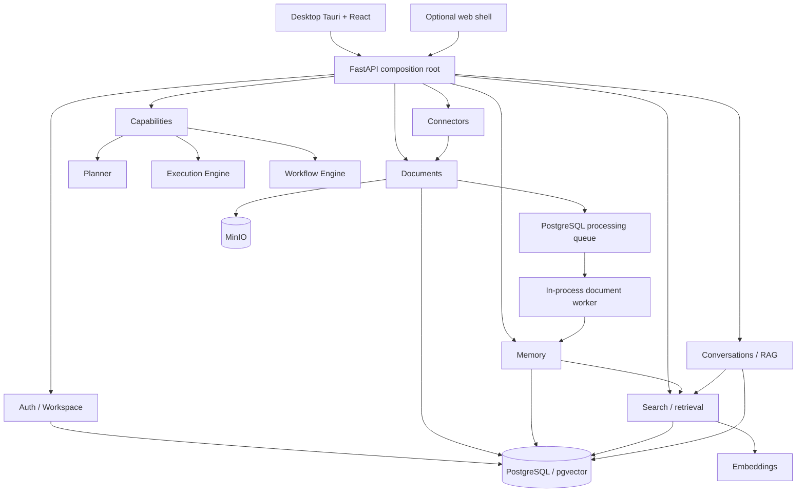

# Memovi Architecture

> This document is the high-level architectural blueprint for Memovi. It defines the platform shape, canonical boundaries, and documentation map. Detailed engineering references live under `architecture/`.

For the canonical product vision—what Memovi is and why the architecture
exists—see [`PRODUCT_VISION.md`](PRODUCT_VISION.md).

---

# Purpose

Memovi is a desktop-first, AI-native knowledge operating system built on a
reusable backend platform. It is not primarily a web application, and it is not
a collection of isolated AI features.

The flagship client is a desktop application. The same client-agnostic API also
supports an optional web client and can support future mobile or CLI clients
without changing backend domain architecture.

The purpose of this document is to provide a complete architectural overview of the platform without carrying every implementation detail. It explains the goals, principles, system layers, domain boundaries, repository organization, knowledge lifecycle, and technology choices that guide the project.

The focused documents under `architecture/` expand this blueprint. When deeper detail is needed, follow the links in the Documentation Map rather than duplicating material here.

This document is intended for:

* Engineers contributing to Memovi
* Future maintainers
* AI coding assistants such as Cursor
* Reviewers interested in the system's design

Whenever implementation and architecture diverge, update one or both so the system and its documentation remain aligned.

**How to read this document:** sections describe **current V1** unless they are
explicitly labeled **future / V2**. Long-term goals (OCR, knowledge graph,
additional connectors, plugins, distributed workers, hosted deployments) remain
valid vision. They are not running infrastructure.

---

# V1 Runtime (current)

What actually runs when you launch Memovi locally:

```text
Desktop Tauri + React
        │
        ▼
FastAPI composition root
        │
        ├── Auth / Workspace
        ├── Documents
        │       │
        │       ▼
        │   PostgreSQL processing queue
        │       │
        │       ▼
        │   in-process DocumentProcessingWorker
        │       │
        │       ▼
        │   ProcessingCompleted
        ├── Memory  (materialize knowledge + chunks)
        │       │
        │       ▼
        │   Search / retrieval
        │       │
        │       ▼
        │   embedding generation
        ├── Conversations / RAG
        └── Capabilities
                ├── Planner
                ├── Execution Engine
                ├── Workflow Engine
                └── Connectors (filesystem; manual sync)
```


```mermaid
flowchart TD
    Desktop[Desktop Tauri + React]
    Web[Optional web shell]
    Desktop --> API
    Web --> API
    API[FastAPI composition root]
    API --> Auth[Auth / Workspace]
    API --> Documents
    API --> Memory
    API --> Search[Search / retrieval]
    API --> Intelligence[Conversations / RAG]
    API --> Automation[Capabilities]
    API --> Connectors
    Documents --> Queue[PostgreSQL processing queue]
    Queue --> Worker[In-process document worker]
    Worker --> Memory
    Memory --> Search
    Search --> Embed[Embeddings]
    Intelligence --> Search
    Automation --> Planner
    Automation --> Engine[Execution Engine]
    Automation --> Workflows[Workflow Engine]
    Connectors --> Documents
    Auth --> PG[(PostgreSQL / pgvector)]
    Documents --> PG
    Memory --> PG
    Search --> PG
    Intelligence --> PG
    Documents --> MinIO[(MinIO)]
```

**V1 infrastructure:** PostgreSQL with pgvector, MinIO, the FastAPI process
(including the in-process worker and in-process event handlers), and the Tauri
desktop client. Compose is `compose.yml` at the repository root.

**Not used in V1:** Redis, Redis Streams, distributed worker processes, OCR
workers, knowledge-graph construction, entity-extraction workers, AI summary
workers, Prometheus/Grafana/Loki as a deployed stack, production Docker images
under `docker/`, Kubernetes, a connector cron/watch loop, or Intelligence
`ToolRegistry` / `ToolExecutor` (removed). Host execution is Capabilities →
Planner → Execution Engine → Workflow Engine.

Knowledge is the product. Memory is the architecture. AI is a consumer of
knowledge — not its owner.

---

# Architectural Goals

Memovi's architecture is organized around a small number of long-term goals.

## Build a Platform

Memovi is not a single UI.

It is a reusable backend platform whose flagship product is a desktop knowledge
operating system. The API is the platform boundary. Additional clients—optional
web, future mobile, CLI, browser extensions, public APIs, and third-party
integrations—consume the same capabilities.

Every client should interact with the same core platform. Business logic should
never be duplicated simply because a new client is introduced. Clients are
replaceable; backend domains remain independent.

Desktop is the preferred experience because it enables local models, filesystem
access, automation, and a richer UX without changing backend architecture.

## Knowledge Is the Product

The platform exists to organize, preserve, retrieve, and enrich knowledge.

Artificial intelligence is one consumer of that knowledge. It is not the system itself.

This distinction allows Memovi to remain valuable regardless of which language model, embedding model, or AI provider is used. Knowledge should remain portable, structured, and independently useful.

## Design for Evolution

Requirements will change. New connectors will be built. Search techniques will improve. AI providers will evolve.

The architecture is optimized for change. Systems should be extended rather than replaced whenever possible.

## Maintain Strong Boundaries

Every domain owns a clearly defined responsibility.

Modules communicate through stable interfaces and domain events rather than implementation details. Strong boundaries reduce coupling today and enable future service extraction if operational requirements justify it.

## Favor Operational Simplicity

Operational complexity is introduced only when it provides measurable value.

Memovi begins as a modular monolith because it minimizes deployment complexity while preserving architectural boundaries. Additional infrastructure should be introduced only after operational requirements demonstrate a clear need.

---

# Architectural Principles

## Modular Monolith

Memovi begins as a modular monolith. Each business domain exists as an independent module within a single deployable application.

Every module owns its public APIs, application services, domain models, persistence, domain events, and tests. Modules communicate through well-defined interfaces and events rather than direct implementation details.

The goal is not to avoid microservices. The goal is to delay distributed complexity until it becomes operationally beneficial.

See [`architecture/module-architecture.md`](architecture/module-architecture.md).

## Domain-Driven Design

The system is organized around business domains rather than technical layers.

Core domains include:

* Authentication
* Documents
* Memory
* Search
* Connectors
* Intelligence
* Automation (Capability Framework)

Each domain contains everything required to fulfill its responsibility. Business rules remain independent of frameworks, databases, and infrastructure.

See [`architecture/domains.md`](architecture/domains.md).

## Layered Architecture

Every component belongs to one architectural layer. Responsibilities do not cross layers without explicit justification.

The primary layers are:

1. Presentation
2. Application
3. Knowledge Platform
4. Intelligence
5. Processing
6. Infrastructure

Dependencies point downward. Lower layers never depend on higher layers.

See [`architecture/module-architecture.md`](architecture/module-architecture.md).

## Event-Driven Processing

Long-running operations communicate through domain events whenever doing so reduces coupling.

Examples include:

* Document uploaded
* Embeddings generated
* Connector synchronized
* Memory indexed

Events describe what happened. They do not command other components what to do.

See [`architecture/event-architecture.md`](architecture/event-architecture.md).

## Asynchronous Workflows

Expensive operations should not block the user experience.

In V1, document parsing, chunk generation, embedding creation, and search
indexing continue after upload via a PostgreSQL-backed job queue and an
in-process worker, then in-process event handlers. OCR, AI summarization, and
entity extraction are **future / V2** processing stages, not live workers.

See [`architecture/request-lifecycle.md`](architecture/request-lifecycle.md) and [`architecture/knowledge-processing-pipeline.md`](architecture/knowledge-processing-pipeline.md).

## API-First Design

Every capability exposed by the platform should be accessible through stable
application interfaces. The API is the platform boundary between reusable
backend domains and replaceable clients.

Desktop, optional web, and future clients consume the same platform capabilities
rather than implementing business logic independently.

See [`architecture/request-lifecycle.md`](architecture/request-lifecycle.md).

## Self-Hostable by Default

Memovi is designed to be deployable on personal hardware, home servers, or cloud infrastructure.

No architectural decision should unnecessarily require proprietary cloud services. Cloud-native technologies are encouraged; cloud-required architecture is avoided whenever practical.

See [`architecture/deployment.md`](architecture/deployment.md).

## Observability by Design

Operational visibility is a core architectural concern.

The platform should provide visibility into requests, background jobs, AI inference, connector synchronization, search operations, errors, and performance.

See [`architecture/observability.md`](architecture/observability.md).

---

# High-Level System Architecture

Memovi is organized as a layered knowledge platform.

Information enters the platform through connectors, is processed into structured knowledge, stored in a unified memory system, and later retrieved by users or intelligent services.

This separation allows knowledge to remain independent from the technologies used to analyze or consume it. As artificial intelligence evolves, the platform should adopt new models, reasoning systems, and retrieval techniques without changing how knowledge is stored or managed.

The V1 runtime diagram is in [V1 Runtime (current)](#v1-runtime-current).
Optional web and future clients attach at the same API without changing
Documents, Memory, Search, or Intelligence.

---

# System Layers

```text
Presentation
        │
        ▼
Application
        │
        ▼
Knowledge Platform
        │
        ▼
Intelligence
        │
        ▼
Processing
        │
        ▼
Infrastructure
```

## Presentation Layer

The Presentation Layer contains every interface through which users interact with Memovi.

The primary product surface is the desktop application under `apps/desktop`
(Tauri + React). An optional web client shell, and future mobile, CLI, or
extension clients, are additional presentation surfaces over the same backend. See [`architecture/DESKTOP_CLIENT.md`](architecture/DESKTOP_CLIENT.md).
Desktop build, smoke, and packaging CI are documented in
[`testing/DESKTOP_TESTING.md`](testing/DESKTOP_TESTING.md).

Responsibilities:

* Render user interfaces
* Accept user input
* Display results
* Authenticate users
* Call platform APIs
* Manage window lifecycle, navigation shell, theme, and backend connection status

The Presentation Layer contains no business logic. Business rules belong within
the Application Layer and domains. Clients remain replaceable; backend domains
do not depend on any specific UI technology.

## Application Layer

The Application Layer coordinates work across domains.

Responsibilities include request validation, authorization, commands, queries, application services, transaction boundaries, DTOs, and API orchestration.

The Application Layer coordinates platform services. It does not parse documents,
generate embeddings, call AI providers, or query vector indexes directly.

## Knowledge Platform Layer

The Knowledge Platform Layer is the heart of Memovi.

Primary concerns include Documents, Memory, Search, Connectors, Collections,
Tags, and Metadata. A knowledge graph is **future / V2**; explorer
concepts/relationships today are provenance projections, not graph infrastructure.

This layer organizes knowledge, stores metadata, manages relationships, retrieves information, and maintains consistency. It must remain valuable even when no AI services are available.

## Intelligence Layer

The Intelligence Layer consumes knowledge. It never owns it.

V1 responsibilities include chat, retrieval-augmented generation, prompt
construction, provider routing, and reasoning. AI summaries and autonomous
agents are **future / V2**. Host actions are not executed inside Intelligence;
they run through the Automation Capability Framework.

The `packages/intelligence` package currently defines the reasoning domain foundation (`ReasoningRequest`, `ReasoningContext`, `ReasoningResult` with citations, provider metadata, a read-only `execution_trace`, and unused `tool_calls` / `tool_results` fields retained as type plumbing rather than an execution framework), conversation memory (`Conversation`, `ConversationTurn`, `ConversationHistory`, `ConversationService`), immutable execution tracing value objects (`ExecutionTrace`, `ExecutionStage`, `StageTiming`, `ExecutionMetrics`), `ContextAssembler` for deterministic context assembly with optional conversation history, provider-agnostic `PromptBuilder` / `Prompt` construction, `ModelGateway` as the single prompt-execution entry point (provider selection + execution metadata + optional streaming), application ports (`KnowledgeRetriever`, `ReasoningProvider`, `ConversationRepository`), the `Reason` command for retrieve → assemble → prompt → gateway orchestration with per-stage timing, the `SendConversationMessage` use case that persists conversation turns around Reason (sync and SSE stream), a Conversation REST API (`/conversations` list/create/rename/delete, `/conversations/{id}/messages`, `/conversations/{id}/messages/stream`, `/conversations/models`), and provider adapters including `FakeReasoningProvider` and `OpenAIReasoningProvider`. The composition root wires Search-backed retrieval through `SearchKnowledgeRetriever` and durable conversations through `SqlAlchemyConversationRepository` without importing Search into Intelligence. LLM tool calling, WebSockets, and agents are not implemented.

The `packages/automation` package defines the Capability Framework (`Capability`, `CapabilityRegistry`, `CapabilityInvoker`, `CapabilityMetadata`, `CapabilityPermission`, `CapabilityRequest`, `CapabilityResult`, `CapabilityContext`, `CapabilityExecutionPolicy`), the Capability Execution Engine, the Capability Planner (`CapabilityPlanner`, `ExecutionPlan`, `ExecutionPlanValidator`, `PlanExecutionService`), the Workflow Automation Framework (`WorkflowEngine`, `WorkflowDefinition`, `WorkflowValidator`, `WorkflowHistory`), and production capabilities: root-scoped `FilesystemCapability` (`filesystem`), `TerminalCapability` (`terminal`), `GitCapability` (`git`), and `BrowserCapability` (`browser`). Capabilities are provider-agnostic, permission-declared environment actions that Intelligence discovers and submits only through the execution engine. The planner builds deterministic multi-step execution plans but never invokes capabilities; plan steps execute only through the engine. Workflows are reusable sequential capability sequences with variables and input/output mapping; each step is planned through the Capability Planner and executed only through the engine (HTTP under `/workflows`). This is not an agent framework: there is no autonomous goal-seeking loop, and workflows do not yet support loops, conditionals, parallelism, or background scheduling. Filesystem access is traversal-safe with fine-grained read/create/modify/move/delete permissions, explicit overwrite policies, and trash-first deletion. Terminal execution is cwd-root-scoped with timeouts, output caps, cancellation, process termination, and structured stdout/stderr/exit capture — never exposed directly to the LLM. Git exposes structured repository operations (`status`, branches, commit, diff, remotes) with `git.read` / `git.write` / `git.network` — Intelligence never constructs shell commands for Git. Browser exposes structured web operations (open/read/search/download) with `browser.read` / `browser.search` / `browser.download`; downloads integrate with Filesystem roots and never bypass the execution engine. See [`architecture/CAPABILITY_FRAMEWORK.md`](architecture/CAPABILITY_FRAMEWORK.md), [`architecture/CAPABILITY_EXECUTION.md`](architecture/CAPABILITY_EXECUTION.md), [`architecture/CAPABILITY_PLANNER.md`](architecture/CAPABILITY_PLANNER.md), [`architecture/WORKFLOW_AUTOMATION.md`](architecture/WORKFLOW_AUTOMATION.md), [`architecture/FILESYSTEM_CAPABILITY.md`](architecture/FILESYSTEM_CAPABILITY.md), [`architecture/FILESYSTEM_WRITE.md`](architecture/FILESYSTEM_WRITE.md), [`architecture/TERMINAL_CAPABILITY.md`](architecture/TERMINAL_CAPABILITY.md), [`architecture/GIT_CAPABILITY.md`](architecture/GIT_CAPABILITY.md), and [`architecture/BROWSER_CAPABILITY.md`](architecture/BROWSER_CAPABILITY.md).

Provider-specific logic remains isolated so replacing one AI provider with another requires minimal architectural change. Intelligence owns the live provider boundary: `ModelGateway` selects among registered `ReasoningProvider` implementations (`fake`, `openai`). Host actions use the Automation Capability Framework (Capability Registry, Planner, Execution Engine, approval / policy, Workflow Engine, Connector Framework). There is no Intelligence `ToolRegistry` / `ToolExecutor`. `ReasoningResult.tool_calls` / `tool_results` remain unused type plumbing, not a live tool-calling path.

## Processing Layer

The Processing Layer performs long-running asynchronous work without blocking
the upload request.

**V1:** PDF, Markdown, and plain-text parsing in `DocumentProcessingWorker`
(in-process, PostgreSQL job queue), then Memory materialization, Search
document materialization, and embedding generation via in-process event
handlers. See [`architecture/DOCUMENT_PIPELINE.md`](architecture/DOCUMENT_PIPELINE.md).

**Future / V2:** OCR, AI summarization, entity extraction, graph construction,
and out-of-process / distributed workers.

Processing components should remain focused. V1 uses one document worker plus
event handlers rather than a fleet of specialized worker processes.

## Infrastructure Layer

The Infrastructure Layer provides technical capabilities required by the rest of the platform.

V1 examples include PostgreSQL, pgvector, MinIO, structured logging, in-process
metrics, OpenTelemetry API spans, Docker Compose for local Postgres/MinIO, and
typed configuration. Redis is **not used in V1**. Distributed queues or Redis
Streams remain **future / V2** options — do not add Redis to recreate this
document.

Infrastructure exists to support the platform. Business decisions should never originate from infrastructure components.

---

# Domain Overview

Memovi is organized around business capabilities rather than technical concerns.

```text
                 Memovi

              Application
                    │
    ┌───────────────┼───────────────────┐
    │               │                   │
    ▼               ▼                   ▼
 Authentication  Knowledge         Intelligence
                    │                   │
        ┌───────────┼───────────┐       │
        ▼           ▼           ▼       ▼
   Documents     Memory      Search  Automation
                    │
              Connectors

 Workspace (shared ownership boundary)
```

Every feature implemented within Memovi should belong to one of the core domains. If a feature does not clearly belong to an existing domain, a new domain should only be introduced after careful consideration.

Primary domain responsibilities:

| Domain | Responsibility |
| --- | --- |
| Authentication | User identity and access control |
| Workspace | Ownership boundary for knowledge resources |
| Documents | Raw information entering the platform |
| Memory | Persistent structured knowledge |
| Search | Retrieval, ranking, filtering, and query planning |
| Connectors | External system integration and normalization |
| Intelligence | Reasoning over retrieved knowledge |
| Automation | Capability Framework for permissioned environment actions |

Request ownership context is resolved once at the API composition root. Optional `X-Memovi-Workspace-Id` selects an existing workspace; when omitted, requests use the seeded Default Workspace. Downstream domains receive a required `WorkspaceId` and never invent ownership.

See [`architecture/domains.md`](architecture/domains.md).

---

# Repository Overview

Memovi uses a production-oriented monorepo.

```text
memovi/

├── apps/
├── packages/
├── docs/                 # product, planning, architecture, development docs
│   ├── README.md         # documentation hub
│   ├── PRODUCT_VISION.md
│   ├── ARCHITECTURE.md
│   ├── ROADMAP.md
│   ├── STATUS.md
│   ├── adr/
│   ├── architecture/     # deep-dives
│   └── development/
├── compose.yml           # local PostgreSQL + MinIO
├── docker/               # reserved; empty in V1
├── scripts/
├── .github/
├── .cursor/

├── README.md             # repository entry point
├── LICENSE
└── .env.example
```

This structure separates application code, reusable platform libraries, infrastructure, and documentation into clearly defined areas. Project docs live under `docs/`; the root keeps only the entry README.

Top-level responsibilities:

| Area | Responsibility |
| --- | --- |
| `apps/` | Deployable applications |
| `packages/` | Reusable platform libraries |
| `docs/` | Engineering documentation |
| `docker/` | Reserved for future container assets (empty in V1) |
| `compose.yml` | Local PostgreSQL and MinIO |
| `scripts/` | Automation |
| `.github/` | Repository automation |
| `.cursor/` | AI development guidance |

See [`architecture/repository-architecture.md`](architecture/repository-architecture.md).

---

# Knowledge Processing Overview

Every capability in Memovi strengthens the same knowledge pipeline.

```text
Connect
      │
      ▼
Normalize
      │
      ▼
Store
      │
      ▼
Index
      │
      ▼
Retrieve
      │
      ▼
Reason
      │
      ▼
Present
```

Every connector, search strategy, AI provider, and future capability contributes to one stage of this lifecycle.

Every piece of information follows the same lifecycle regardless of its source:

```text
External Source
        │
        ▼
Connector
        │
        ▼
Normalized Document
        │
        ▼
Document Storage
        │
        ▼
Processing Pipeline
        │
        ▼
Knowledge Platform
        │
        ▼
Search & Retrieval
        │
        ▼
Intelligence
        │
        ▼
User
```

**V1 sources:** desktop upload (PDF, Markdown, plain text) and the filesystem
connector (manual folder sync). **Future / V2 sources** may include GitHub,
email, Slack, and other connectors. Once normalized, downstream systems should
not need to know where the information originally came from.

See [`architecture/knowledge-processing-pipeline.md`](architecture/knowledge-processing-pipeline.md).

---

# Technology Overview

## Clients (V1)

* Desktop application (`apps/desktop` Tauri + React; primary product surface)
* Optional web client (`apps/web` shell; Next.js / React / TypeScript)
* Future mobile, CLI, and extension clients as needed

Clients call the platform API. They do not own knowledge, retrieval, or reasoning.

## Backend (V1)

* FastAPI
* SQLAlchemy
* Pydantic
* Alembic

## Infrastructure (V1)

* PostgreSQL
* pgvector
* MinIO
* Docker Compose (`compose.yml`) for local Postgres and MinIO

Redis is **not used in V1**. Distributed queues or Redis Streams remain
**future / V2** architectural options.

The `docker/` directory is reserved; V1 does not ship production Dockerfiles or
Kubernetes manifests there.

## AI (V1)

**Reasoning adapters registered today:** `fake`, `openai`.

**Embedding providers configurable today:** `fake`, `openai`, `ollama`,
`sentence_transformer`.

Configuration enums may list reserved names (for example Anthropic or Gemini
reasoning). Those are **not** live V1 reasoning adapters.

## Observability (V1)

* Structured application logging
* OpenTelemetry **API** spans (no required exporter)
* In-process `MetricsRecorder`
* `GET /health` and `GET /ready`

Prometheus, Grafana, and Loki are **future / V2** deployment options. V1 does
not run that stack.

---

# Key Architectural Decisions

The high-level architecture establishes these constraints:

* Memovi is a knowledge platform rather than an AI application.
* Knowledge is the primary product; AI enhances but does not own it.
* The platform begins as a modular monolith.
* Business logic is organized by domain.
* Every client interacts with the same platform capabilities.
* Knowledge is normalized before downstream processing begins.
* Long-running work is asynchronous whenever appropriate.
* Components communicate through stable interfaces and domain events.
* PostgreSQL is the authoritative source of truth.
* pgvector and generated indexes store derived data. Redis is **not used in V1**.
* Operational simplicity is preferred over premature distribution.
* Architectural boundaries take precedence over implementation convenience.

---

# Documentation Map

The following documents expand this blueprint without redefining it.

| Document | Purpose |
| --- | --- |
| [`README.md`](README.md) | Documentation hub |
| [`PRODUCT_VISION.md`](PRODUCT_VISION.md) | Canonical product vision |
| [`architecture/README.md`](architecture/README.md) | Architecture deep-dive index and reading guide |
| [`architecture/domains.md`](architecture/domains.md) | Domain responsibilities, ownership, communication, and future domains |
| [`architecture/module-architecture.md`](architecture/module-architecture.md) | Modular monolith, layers, dependency direction, and service boundaries |
| [`architecture/repository-architecture.md`](architecture/repository-architecture.md) | Monorepo structure, top-level directories, and repository evolution |
| [`architecture/request-lifecycle.md`](architecture/request-lifecycle.md) | Synchronous request flow, async transitions, failures, and transactions |
| [`architecture/event-architecture.md`](architecture/event-architecture.md) | Event philosophy, lifecycle, ownership, workers, versioning, and failure handling |
| [`architecture/knowledge-processing-pipeline.md`](architecture/knowledge-processing-pipeline.md) | Ingestion, normalization, storage, processing, indexing, retrieval, and intelligence stages |
| [`architecture/storage-architecture.md`](architecture/storage-architecture.md) | PostgreSQL, pgvector, MinIO, data ownership, backup, and versioning |
| [`architecture/search-architecture.md`](architecture/search-architecture.md) | Search responsibility, retrieval strategies, indexes, ranking, and boundaries |
| [`architecture/SEARCH.md`](architecture/SEARCH.md) | Embedding provider configuration, production recommendations, testing |
| [`architecture/intelligence-architecture.md`](architecture/intelligence-architecture.md) | AI's role, provider routing, RAG, summaries, planning, and boundaries |
| [`architecture/CONNECTOR_FRAMEWORK.md`](architecture/CONNECTOR_FRAMEWORK.md) | Connector framework + Filesystem Connector into Documents |
| [`architecture/AUTHORIZATION.md`](architecture/AUTHORIZATION.md) | Authentication, membership, capability security, and trust boundaries |
| [`architecture/CAPABILITY_FRAMEWORK.md`](architecture/CAPABILITY_FRAMEWORK.md) | Capability abstractions, registry, permissions, invocation; plugin path is future |
| [`architecture/CAPABILITY_EXECUTION.md`](architecture/CAPABILITY_EXECUTION.md) | Execution engine pipeline, approval, and audit |
| [`architecture/FILESYSTEM_CAPABILITY.md`](architecture/FILESYSTEM_CAPABILITY.md) | Filesystem capability safety model and operations |
| [`architecture/TERMINAL_CAPABILITY.md`](architecture/TERMINAL_CAPABILITY.md) | Terminal capability execution, safety, timeout, cancel, and audit |
| [`architecture/GIT_CAPABILITY.md`](architecture/GIT_CAPABILITY.md) | Git capability structured ops, permissions, and result model |
| [`architecture/BROWSER_CAPABILITY.md`](architecture/BROWSER_CAPABILITY.md) | Browser capability: navigation, read, search, download, safety |
| [`architecture/CAPABILITY_PLANNER.md`](architecture/CAPABILITY_PLANNER.md) | Plan-then-execute composition; planner never invokes capabilities |
| [`architecture/WORKFLOW_AUTOMATION.md`](architecture/WORKFLOW_AUTOMATION.md) | Reusable sequential workflows over planner + execution engine |
| [`architecture/WORKSPACES.md`](architecture/WORKSPACES.md) | Workspace membership lifecycle, roles, owner enforcement, and audit |
| [`architecture/DESKTOP_CLIENT.md`](architecture/DESKTOP_CLIENT.md) | Flagship Tauri desktop shell, client boundaries, and API communication |
| [`testing/DESKTOP_TESTING.md`](testing/DESKTOP_TESTING.md) | Desktop CI, mock and live smoke tests, packaging, and release validation |
| [`testing/NATIVE_DESKTOP_SMOKE.md`](testing/NATIVE_DESKTOP_SMOKE.md) | Packaged WebView session-cookie verification (local, not CI) |
| [`architecture/observability.md`](architecture/observability.md) | Request, worker, event, AI, connector, search, error, and performance telemetry |
| [`architecture/deployment.md`](architecture/deployment.md) | Self-hostable deployment posture, infrastructure isolation, and runtime concerns |
| [`architecture/scaling.md`](architecture/scaling.md) | Evolution strategy, future extraction, storage scaling, workers, and operational thresholds |

